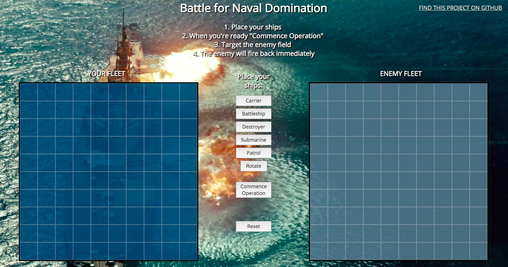
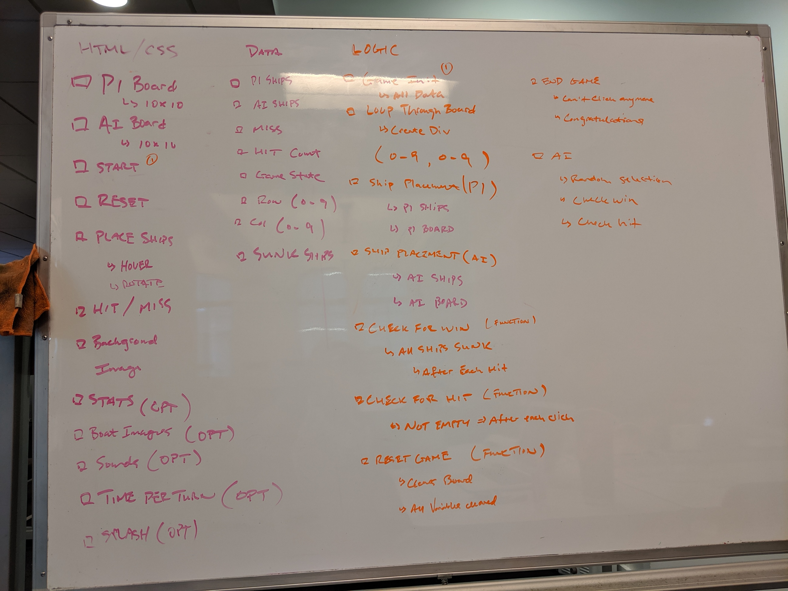
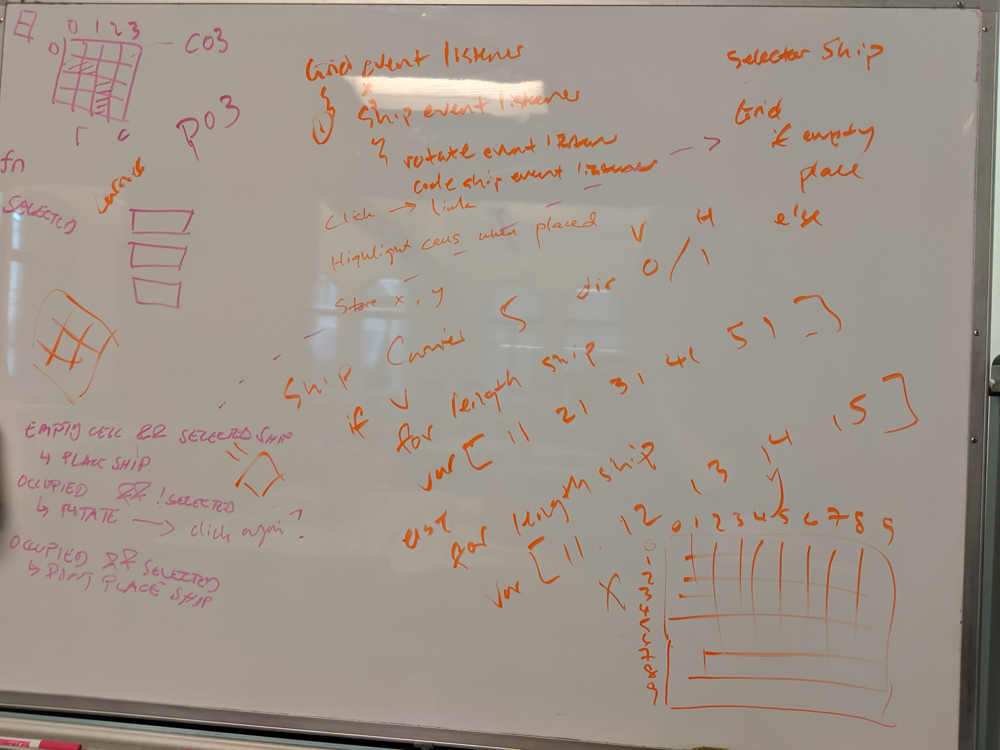
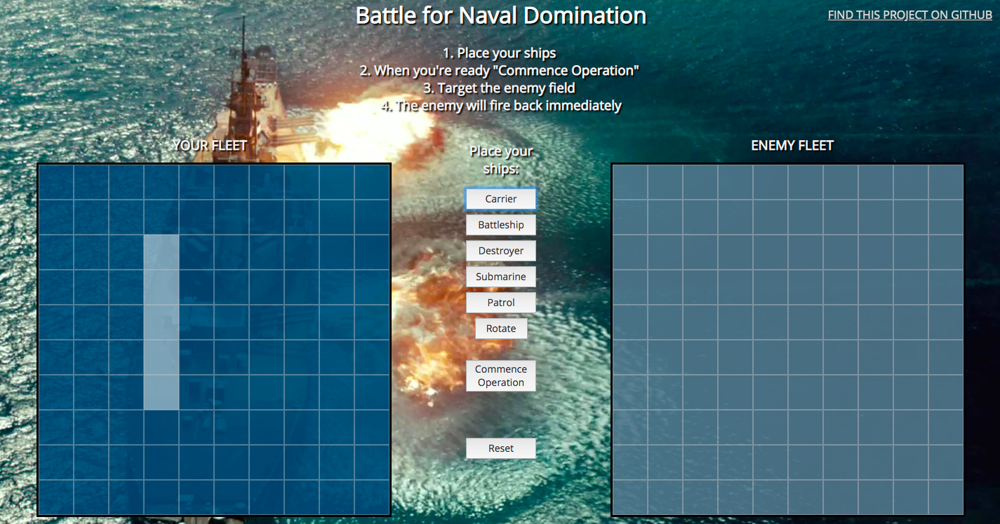

# Battle of the Ships
## Nathan Chan | June 14, 2019
### General Assembly - Software Engineering Immersive Project 1: HTML, CSS, Javascript
#### A link to the game can be found here: 


## Introduction 
The classic game of Battleship pitting two opponents against one another which incorporates strategic thinking and crucial decision making. 

##### Original game:


##### Screenshot of the gameplay:



## Project Requirements
This is the first project that will be incorporated as part of the portfolio of the General Assembly Software Engineering Immersive. The goal is to combined all that we have learned in Unit 1 (HTML, CSS, and Javascript) into a web game that we can publish. 

### Technical Requirements
The technical requirements for the project are as follows: 

Your app must:
* Display a game in the browser
* Switch turns between two players, or switch turns between a player and the computer (AI)*
* Design logic for winning & visually display which player won
* Include separate HTML / CSS / JavaScript files
* Stick with KISS (Keep It Simple Stupid) and DRY (Don't Repeat Yourself) principles
* Use Javascript or jQuery for DOM manipulation
* Deploy your game online, where the rest of the world can access it**
* Use semantic markup for HTML and CSS (adhere to best practices)

## How to Play
1. Clone this repo or click the link above to launch the game in your browser. 
2. Follow the instructions displayed in the game to play. 

# Building the App
This section presents the thought process that went into the creation of this game. 

*This project was designed for desktop implementation only*

## Thought Process
Overall the game uses two grid elements: one for the player's board and the other for the computer's board. The project includes manipulation of arrays and objects as well as an AI which will play against the player. 

### Whiteboarding
Initial design of the project and the necessary components were designed on pen and paper to brainstorm necessary variables, DOM elements, functionality, and logic of the game. 

##### Whiteboarding thought process:






After some initial planning, the overall flow of the gameplay is as follows:
1. Upon page load, a Start Screen appears. The player can click Start to play the game when he or she is ready. 
2. Player can place ships on his or her board and is not allowed to fire on opponent's board. 
3. Once ships are placed then the player can begin firing on the opponent's board. The opponent will fire back after the player takes a turn. 
4. Once there is a winnner, the game ends and the player can reset the gameboard and start over.


After page load and once the Start button has been clicked, the actual game play was designed by breaking down the game into its simplest component which revolves around one turn of the game. This would is also constitute the game loop. 

## Two Tracks
The project design essentially followed two tracks. 
1. The AI's board and actions
2. The player's board and actions 


## Gameboard Creation and Ship Creation

### Gameboard
Rather than creating the gameboard in the HTML file, the gameboards were created in Javascript by accessing the DOM element in which I wanted to create the grid and iterating through to create the appropriate grid cells while giving them a coordinate ID which is important for other aspects of the game. 

```
function createGameBoards () {
        for (let i = 0; i <= 9; i++) {
            for (let j = 0; j <= 9; j++) {
                var playerSquare = document.createElement("div");
                playerBoard.appendChild(playerSquare);
                playerSquare.classList.add("square")
                playerSquare.id = "p" + i + j; 
                var computerSquare = document.createElement("div");
                computerBoard.appendChild(computerSquare);
                computerSquare.classList.add("square")
                computerSquare.id = "c" + i + j; 
                
            }
        }
    };
```
### Ships
The ships were created as objects as objects provide the benefit of being able to associate different attributes to one particular object (in this case a ship). 

The ships were initialized with a name, a length of the ship, a location array to store the location IDs, and a hit array to store the IDs that consitute a hit. 

## AI's Board

### Initialization
The AI's board was initialized as a 10x10 array with asssociated variables that could be loaded into the array describing the condition of that particular position:

```
var aiBoard = 
[[0,0,0,0,0,0,0,0,0,0],
[0,0,0,0,0,0,0,0,0,0],
[0,0,0,0,0,0,0,0,0,0],
[0,0,0,0,0,0,0,0,0,0],
[0,0,0,0,0,0,0,0,0,0],
[0,0,0,0,0,0,0,0,0,0],
[0,0,0,0,0,0,0,0,0,0],
[0,0,0,0,0,0,0,0,0,0],
[0,0,0,0,0,0,0,0,0,0],
[0,0,0,0,0,0,0,0,0,0]];
const EMPTY = 0;
const MISS = 1;
const SHIP = 2;
const HIT = 3;
const SUNK = 4; 
```

### Random Placement of Ships
The placement of the ships was done by randomly generating a "2" to place into the aiBoard variable. The number of "2s" to place were determined based on the length of the ships which were accessed through the ship objects. 

### Checking the Placement of Ships
However, there are some limitations as to where the ships can be placed:
1. The ships cannot be placed off the grid
2. The ships cannot be placed where another ship exists

These limitations were incorporated into the Random Placement of Ships functionality. 

## Player's Board
This was the most challenging aspect of this project. How can the player place a ship, change the rotation and for that choice to display visually. 

Instead of creating an array with values that can be hardcoded. The player board grid elements were accessed with their HTML IDs. 

### Placement and Rotation
What made this challenging was the placement of the ships while allowing the player the opportunity to choose which ship to place and to rotate the ship as desired.

This process followed the below steps:
1. The player can select which ship he or she wants to place using the provided buttons
2. The player can see where he or she is thinking about placing the ship by hovering over the player's board. 
3. The player can rotate the ship if he or she wants by clicking the rotate button. 
4. The player can click to place the ship and once the ship has been placed you can no longer place another one of the same ship. 

### Mouseover and Mouseoff 
What was challenging was showing where the player was thinking about placing the ship. The mouseover and mouseoff event listeners were used to display which cells the ship would be placed. Ultimately, this was done by choosing the cells and changing the class of the cells to incorporate CSS styling. 

##### Placement:


## Gameplay 
This aspect provide an additional challenge as I needed to combine allow the player to interact with the computer board and the AI to interact with the player's board. 

### FIRE! 
Once the ships have been placed and the player clicks on the "Commence Operation" button, then the player is able to being firing on the AI's board. So the player can click on an individual space and using the aiBoard array, the javascript will check whether there is a ship there to return a hit or miss as well as style the cell appropriately. 

In this version, the AI will randomly select a cell on the player board and fire right after we have fired on them!

There is a check built into the AI guess in order to make sure that the AI does not fire on the same location twice. 


## Audio
This was an interesting feature of the game that I enjoyed learning about which was to incorporate audio files upon certain button clicks especially when the player gets a hit or a miss. 

An interesting note regarding audio was that I found out that I needed to pause the audio and restart the audio clip before playing it. 


### Built with
* HTML 
* CSS
* Javascript


### Credit To:
* Bill Mei - https://github.com/billmei/battleboat
    * Provided initial inspiration for the layout and for the code the place the AI ships on the board and to check whether or not the ships were within the grid. 
* LearnTeachCode - https://github.com/LearnTeachCode/Battleship-JavaScript
    * Provided the thought process and code for creating the gameboard. 
    * Provided the inspiration for how to check whether a player has hit or missed a ship. 

### Additional Functionality and Wish List
* Using ship images for the actual ships
* Do not allow the player to fire on the same spot if he or she has already clicked on that spot. 
* Refine placement of player's ships such that it will not let you place a ship on top of your own ship. I assume the player understands the rules of the game but it would be helpful to prevent that from happening in case the player accidentally clicks on the wrong location. 
* Refining the AI with some probability function or iterative function so that it is not randomly shooting but is able to use previous information to calculate the next move. 
* Cleaning some of the CSS so that the layout does not need to use a fixed or absolute positioning system. 
* Adding CSS animation ot the Start Screen and the display elements. 
* Implement a tablet and mobile friendly version of the game. 